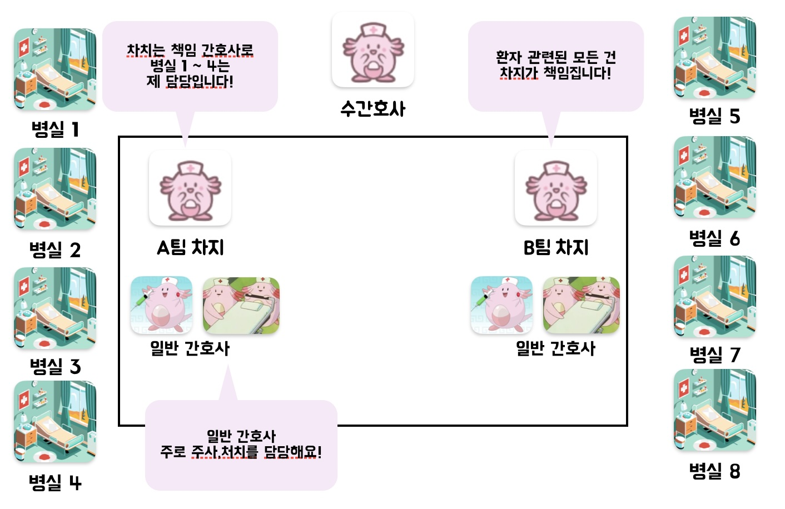
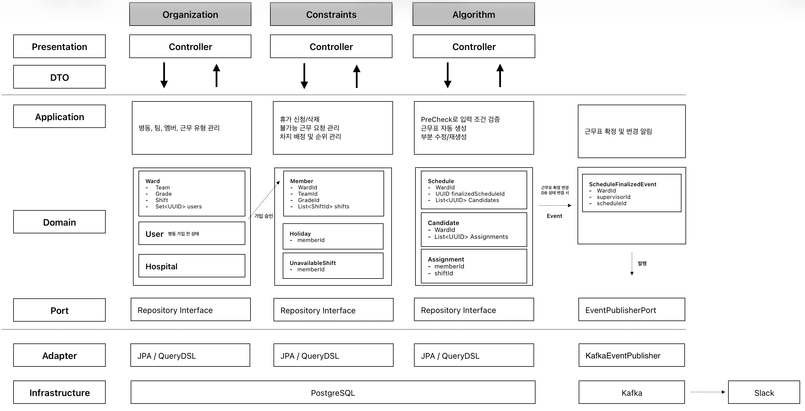
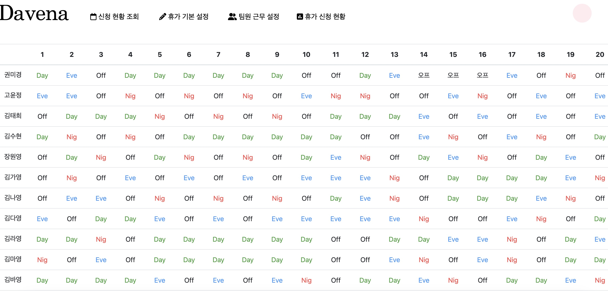

# 💉Davena – 간호사 3교대 근무표 자동 생성 프로그램 

----
Davena는 간호사의 3교대 근무표를 자동으로 생성해주는 서비스입니다. 
수간호사가 수작업으로 근무표를 작성하는 번거로움을 줄이고,  
불공평한 근무 배정 문제를 해결하며,  
간호사들이 충분히 휴식을 취할 수 있도록 공정하고 효율적인 근무표를 제공합니다. 

## 기본 조직도

----

## 아키텍처

----
본 프로젝트는 **Hexagonal Architecture** 기반으로 설계되었습니다.

## 기본 기능

----

- **병동 생성**

  - 기본 팀 1개, 숙련도 등급 1개, 기본 근무 유형(주중/주말 Day, Eve, Nig, OFF) 자동 생성
  - 병동 생성 시 토큰 발급 → 일반 간호사 가입 시 사용

- **병동 가입**
  - 토큰을 통해 병동 조회 및 가입 신청
  - 수간호사가 승인하면 휴가 신청, 불가능 근무 신청, 근무표 조회 가능

- **인사 관리**

  - 간호사의 팀 및 숙련도 배정
  - 근무 유형 추가/수정/삭제 관리 가능

  - 차지 여부 지정 및 차지 순위 설정 → 알고리즘 근무표 생성 시 반영

## 근무표 자동 생성 알고리즘

-----

- **필수 조건 (Hard Constraints)**
    - **휴식 보장**: 한 번 근무를 마치면 다음 근무 전까지 최소 11시간은 쉬어야 함
    - **연속 야간 근무 제한**: 밤 근무(나이트)는 연속으로 2일은 가능, 최대 3일까지 허용
    - **월간 야간 근무 제한**: 한 달 동안의 나이트 근무는 15일을 넘지 않음
    - **나이트 근무 후 회복**: 나이트를 끝낸 뒤에는 반드시 최소 2일 연속 휴무(OFF) 보장
    - **근무/휴무 주기**: 보통 4~5일 근무 후 2일 휴무, 길어도 6일 이상 연속 근무는 불가

- **선호 조건 (Soft Constraints)**
    - **휴가 전날 배려**: 휴가 바로 전날은 나이트 근무를 넣지 않음
    - **과도한 피로 패턴 방지**: ‘밤→오전→저녁’ 같은 무리한 순서를 만들지 않음
    - **주말/공휴일 균등 배분**: 주말 근무는 모두가 공평하게 돌아가며 배정
    - **간호사 요청 반영**: 개인이 희망하는 근무/휴가 요청을 최대한 반영
    - **연속 휴무 선**호: ‘근무-휴무-근무-휴무’처럼 하루하루 끊기는 대신 휴무는 연속으로 보장
    - **공정성 유지**: 전체 간호사들의 근무 선호 점수가 크게 차이 나지 않도록 조정

- **CSP Solver(제약 충족 문제) 아이디어 기반**
    - **사전 검증 (PreCheck)**
        - 휴가 신청 인원이 해당 근무를 실제로 할 수 있는 인원보다 많은 경우 → 아예 근무표 생성 자체가 불가능하므로 탐색 전 차단

  - **전체 흐름**
    1. **근무 가능 인원 조회**
        - 날짜별/근무유형별로 실제 근무 가능한 간호사 리스트를 조회
        - 휴가·불가능 근무 요청을 반영해 후보군 구성

    2. **랜덤 배정 시작**
        - 근무자 목록을 무작위 셔플 후 순차적으로 배정
        - 배정 도중 Hard Constraints(휴식, 연속근무 제한 등)를 검사

    3. **조건 위반 시 폐기**
        - 하나라도 Hard Constraints를 위반하면, 해당 근무표 전체를 폐기하고 처음부터 새로 시도

    4. **선호 조건 고려**
        - Soft Constraints(휴가 전날 나이트 제한, 주말 분배, 선호 점수 균형 등)를 최대한 반영

    5. **후보 근무표 확보**
        - Hard Constraints를 모두 만족하는 근무표가 완성되면 후보군에 추가

    6. **탐색 종료 조건**
        - 유효한 근무표가 10개 확보되면 탐색 종료
        - 20명 × 30일 근무표 기준, 평균 1~2분 내 10개 후보 생성 가능  

## 향후 계획

-----

- 특정 날짜 이후의 근무표를 자동으로 생성하는 기능 추가 예정
- 근무자별 근무 배정 현황을 그래프로 시각화하는 기능 예정
- 근무 배정이 이루어진 이유를 자연어로 설명하는 LLM 기능 도입 예정

